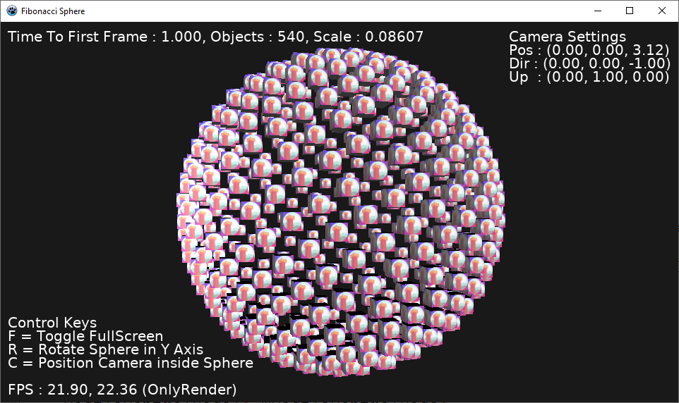

# FibonacciSphere

This is a simple demo program developed using [Castle Game Engine](https://github.com/castle-engine/castle-engine) to illustrate creating a scene using a single object (a textured cube) then position many copies of the one object into a spherical arrangement using a Fibonacci Spiral as described in this [StackOverflow post](https://stackoverflow.com/questions/9600801/evenly-distributing-n-points-on-a-sphere).

This application requires that the Castle Game Engine components are installed into the [Lazarus](https://www.lazarus-ide.org/) / [Free Pascal](https://www.freepascal.org/) development environment.

FibonacciSphere is cross-platform functioning the same on Windows, MacOSX and Linux. It's also cross-CPU having been tested on x64 and Arm64 (with some minor modifications Android and iOS would also work)

(Lazarus 20.11 / FPC 3.2.0 / CGE unstable 6,5 used in development)

### About FibonacciSphere

If compiled and run without alteration the application will start in a 1/4 sized window and will look something like the image above - your FPS etc will vary.

Pressing the 'F' key will switch the application between FullScreen and windowed modes.

Pressing the 'R' key will make the sphere rotate in the Y (vertical) Axis. Repeatedly pressing the 'R' key will pause / resume the sphere rotation.

The application additionally supports CGE's default navigation keys and mouse controls - note that this can be confusing if the sphere is already rotating using the R key...

### Hacking the Code

Well, you can do whatever you want with it but there are a few simple definitions near the top of the file that control everything so it's suggested that you start by tweaking those

Line 50 - SecsPerRot = 30;

Line 52 - ObjectsOnSphere = 540;

Line 54 - ModelFilename = 'castle-data:/box_roty.x3dv';

Line 56 - ScaleMultplier = 1.0;

SecsPerRot controls how long in seconds it takes the sphere to make one full revolution in the Y Axis. 

ObjectsOnSphere controls how many cubes make up the sphere, fewer and the framerate will be higher resulting in smoother animation but beware - if you go stupidly high you will eventually hit a framerate of zero :)

ModelFilename defines the 3d model used to construct the sphere. You can copy a model (obj, x3d, gltf) into the data directory and change the filename here to use something more interesting than a boring textured cube.

ScaleMultplier changes how big the individual objects are displayed. If you change the 3d model then there's a good chance that the objects will be too big for the desired results. Altering this number allows you to scale your chosen model so it fits the scene again. The cube used in this demo is 1x1x1 so if you use a model that's, for example, 3x2x1 in size then setting ScaleMultiplier to (1/3) = 0.3333 will make your model fit in the intended space,

### ToDo

There are quite a few enhancements that I may / may not get around to doing.

- Add a slider to change the number of objects the sphere is comprised of
- Automate ScaleMultiplier calculation
- Re-scale / position the model making it 1x1x1 with an centred internal origin
- Make the sphere 'explode' into existence - this can be done trivially using scaling as a first attempt and refined via randomness later.
- Adjust the rotation of each cube so they all face outwards from the centre of the sphere
- Add an individual rotation to each cube, this could be either synchronised or random
- And, of course, there are many other things I can't thing of right now

